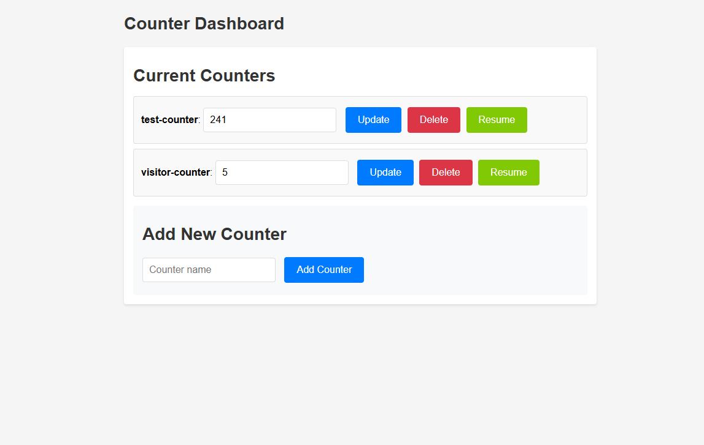

# Visitor Counter for Static Website

Simple Visitor Counter for Static Website.

## What is this?

This is a simple javascript server for a visitor counter, designed especially for static websites. Most visitor counters available do not allow one to display the counter value elsewhere, and this is a simple solution for that. In this case, the counter is stored in a database and is updated whenever the counter is incremented. There is a separate show route that also returns an svg displaying the current count of the counter. Therefore, you can track the number of visitors to your website without displaying it on the website itself.

## Routes available

### `/dashboard`

Presents the following dashboard (password protected) to create and manage counters

( you can put the value of counter in the textbox and click on update to set the counter to the given value )

### `/show?name=countername`

Returns an svg displaying the current value of counter `countername`.
The following themes are also available:

#### Default

#### `&theme=neon`

#### `&theme=glassmorphic`

#### `&theme=retro`

Further, there are customization queries `tb` and `cb` to change the background of text and counter colors respectively, and `tf` and `cf` to change the font-color of text and counter respectively.

#### `&theme=default&tb=0d1117&cb=4493f8`

#### `&theme=default&tb=0d1117&&cb=4493f8&tf=4493f8&cf=0d1117`

You can also change the text on the SVG by using the `text` query.

#### `&text=Custom%20Text`

### `/increment?name=countername`

Increments the counter `countername` by 1.

This comes with a multiple request protection, so you can't increment the counter more than once per minute, per ip-address. This is to prevent spamming of increment by some compilation reloads or in similar cases. It will also keep in check that the counter value is not manipulated by multiple reloads of the page by the same device.

This route will also return the SVG of the counter, useful in cases where you need to increment and show the count in the same place.

Use this route in a hidden iframe if you want to only increment the counter and not display it.

## How to use

1. Clone this repository and deploy your own instance on Vercel (The project is made to be deployed on Vercel, the free plan is enough).

2. Go back to your profile dashboard, navigate to `Storage>Create Database>Upstash>Upstash KV` to create a KV database, and connect it to the project deployment.

3. On your profile dashboard, go to `Settings>Environment Variables` and add Key:`ADMIN_PASSWORD_HASH`, Value: sha256 hash of your password (get the hash from [here](https://emn178.github.io/online-tools/sha256.html)). Connect it to the project deployment.

4. Redeploy the project to ensure all the environment variables are correctly connected.  

5. Once deployed, visit the `/dashboard` route to access your dashboard to create and update counters

6. You can add an iframe in your static website or whichever website you are to track (with `display:none`) pointing to the `/increment` route.

7. You can access the counter SVG by using the `/show` route.

## Example

Number of visitors to this GitHub repo:

