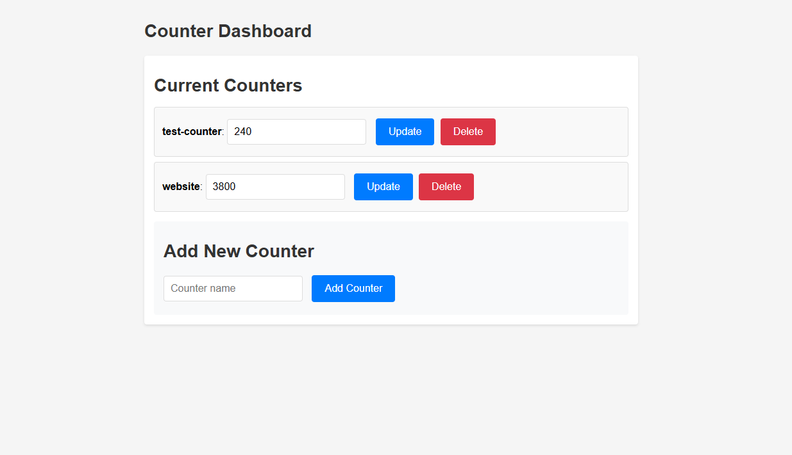

# Visitor Counter for Static Website

Simple Visitor Counter for Static Website.

## Presents the following routes:

### `/dashboard`

Presents the following dashboard (password protected) to create and manage counters

( you can put the value of counter in the texbox and click on update to set the counter to the given value )

### `/increment?name=countername`

Increments the counter `countername` by 1.
Use this route in a hidden iframe in your website to increment the counter.

### `/show?name=countername`

Returns a svg displaying the current count of counter `countername`.
It also presents the following themes: 

#### Default 

#### `&theme=neon`

#### `&theme=glassmorphic`

#### `&theme=retro`

Further, there are customization queries `tb` and `cb` to change the background of text and counter colors respectively, and `tf` and `cf` to change the font-color of text and counter respectively.

#### `&theme=default&tb=0d1117&cb=4493f8`

#### `&theme=default&tb=0d1117&&cb=4493f8&tf=4493f8&cf=0d1117`

## How to use

1. Clone this repository and deploy your own instance on Vercel (The project is made to be deployed on Vercel, the free plan is enough).

2. Go back to your profile dashboard, navigate to `Storage>Create Database>Upstash>Upstash KV` to create a KV database, and connect it to the project deployment.

3. On your profile dashboard, go to `Settings>Environment Variables` and add Key:`ADMIN_PASSWORD_HASH`, Value: sha256 hash of your password (get the hash from [here](https://emn178.github.io/online-tools/sha256.html)). Connect it to the project deployment.

4. Redeploy the project to ensure all the environment variables are correctly connected. 

5. Once deployed, visit the `/dashboard` route to access your dashboard to create and update counters

6. You can add an iframe in your static website or whichever website you are to track (with `display:none`) pointing to the `/increment` route.

7. You can access the counter SVG by using the `/show` route.
